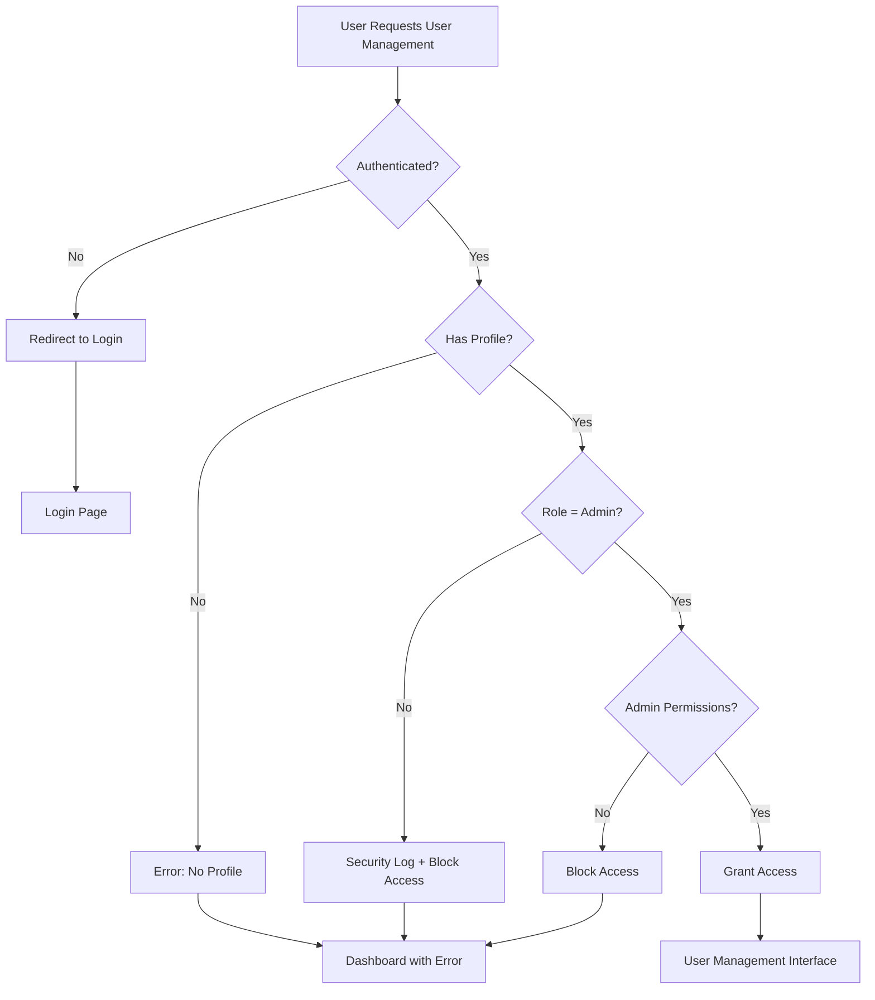

# User Management Security Implementation

## 🔒 Security Overview

The Banbas Resort Management System implements **multi-layered security** to ensure that only Admin users can access user management functionality. Agent and Viewer users are completely blocked from managing users.

## 🛡️ Security Layers

### 1. **AdminRequiredMixin (View-Level Protection)**
```python
class AdminRequiredMixin(RoleRequiredMixin):
    required_role = 'admin'
    
    def dispatch(self, request, *args, **kwargs):
        # Strict admin role verification
        # Security logging for unauthorized attempts
        # Multiple validation checks
```

**Features:**
- ✅ Strict role validation (`role == 'admin'`)
- ✅ Security logging for unauthorized attempts
- ✅ Comprehensive error messages
- ✅ Automatic redirection to dashboard

### 2. **Decorator Protection (URL-Level Protection)**
```python
@admin_required
def user_management_views():
    # Double protection at URL level
```

**Features:**
- ✅ Additional layer of protection
- ✅ Applied to all user management URLs
- ✅ Security audit logging
- ✅ Graceful error handling

### 3. **Template-Level Protection (UI-Level Protection)**
```django

    <!-- User Management Menu Item -->

```

**Features:**
- ✅ Menu item only visible to admins
- ✅ Multiple condition checks
- ✅ Role and permission validation

### 4. **Model-Level Permissions**
```python
class UserProfile:
    def can_edit_reservations(self):
        return self.role == 'admin'
    
    def can_view_revenue(self):
        return self.role == 'admin'
```

## 🔐 Access Control Matrix

| User Role | View Users | Create Users | Edit Users | Access Menu | Security Level |
|-----------|------------|--------------|------------|-------------|----------------|
| **Agent** | ❌ BLOCKED | ❌ BLOCKED   | ❌ BLOCKED | ❌ HIDDEN   | **MAXIMUM**    |
| **Viewer** | ❌ BLOCKED | ❌ BLOCKED   | ❌ BLOCKED | ❌ HIDDEN   | **MAXIMUM**    |
| **Admin** | ✅ ALLOWED | ✅ ALLOWED   | ✅ ALLOWED | ✅ VISIBLE  | **FULL ACCESS** |

## 🚨 Security Features

### Unauthorized Access Protection
- **Automatic redirection** to dashboard
- **Clear error messages** explaining access denial
- **Security logging** of all unauthorized attempts
- **Role-based error messaging**

### Audit Trail
```python
logger.warning(f'Unauthorized access attempt by {username} (role: {role}) to {path}')
```

**Logged Information:**
- Username of the user attempting access
- User's current role
- Requested URL path
- Timestamp of attempt

### Multi-Point Validation
1. **Authentication Check** - User must be logged in
2. **Profile Existence** - User must have a profile
3. **Role Verification** - Must be 'admin' role
4. **Permission Check** - Additional permission validation
5. **URL Pattern** - Pattern-based restrictions

## 🧪 Security Testing

Run the security test script to verify protection:

```bash
python test_user_security.py
```

**Expected Results:**
- ✅ Agent users: **ACCESS BLOCKED** (302 redirect)
- ✅ Viewer users: **ACCESS BLOCKED** (302 redirect)  
- ✅ Admin users: **ACCESS GRANTED** (200 OK)

## 📋 Protected URLs

All user management URLs are protected:

```python
# Protected with AdminRequiredMixin + admin_required decorator
path('users/', admin_required(views.UserListView.as_view()), name='user_list')
path('users/create/', admin_required(views.UserCreateView.as_view()), name='user_create')
path('users/<int:pk>/edit/', admin_required(views.UserEditView.as_view()), name='user_edit')
```

## ⚡ Security Response Flow



## 🔧 Implementation Details

### View Protection
```python
class UserListView(AdminRequiredMixin, ListView):
    def dispatch(self, request, *args, **kwargs):
        # Additional security checks
        try:
            profile = request.user.userprofile
            if profile.role != 'admin':
                messages.error(request, 'Access denied: Only administrators can manage users.')
                return redirect('backoffice:dashboard')
        except UserProfile.DoesNotExist:
            messages.error(request, 'Access denied: No role assigned.')
            return redirect('backoffice:dashboard')
        
        return super().dispatch(request, *args, **kwargs)
```

### Security Logging
```python
import logging
logger = logging.getLogger('security')
logger.warning(f'Unauthorized user management access attempt by {username} (role: {role}) to {path}')
```

## 🎯 Security Best Practices Implemented

1. **Principle of Least Privilege** - Only admins have user management access
2. **Defense in Depth** - Multiple security layers
3. **Fail-Safe Defaults** - Default to deny access
4. **Security Logging** - Comprehensive audit trail
5. **Clear Error Messages** - User-friendly security feedback
6. **Input Validation** - All user inputs validated
7. **Session Management** - Proper authentication checks

## ⚠️ Security Warnings

- **Never remove AdminRequiredMixin** from user management views
- **Always test security** after making changes
- **Monitor security logs** for unauthorized attempts
- **Regular security reviews** recommended
- **Keep role assignments minimal** - only assign admin role when necessary

## 🔍 Monitoring & Maintenance

### Regular Security Checks
1. Run `python test_user_security.py` regularly
2. Review security logs for unauthorized attempts
3. Audit user role assignments quarterly
4. Test all user management functionality after updates

### Security Indicators
- **Green**: All tests pass, no unauthorized access
- **Yellow**: Unusual access patterns detected
- **Red**: Security test failures or unauthorized access granted

---

## 💡 Summary

The user management system is protected by **4 layers of security**:

1. **AdminRequiredMixin** - View-level protection
2. **admin_required decorator** - URL-level protection  
3. **Template conditions** - UI-level protection
4. **Model permissions** - Data-level protection

**Agent users are completely blocked** from accessing any user management functionality through multiple security mechanisms, ensuring the integrity and security of the user management system.